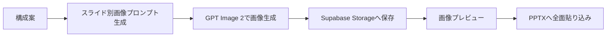
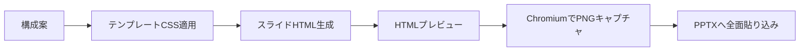

# AI Slide Deck Generator 要件定義書

作成日: 2026-07-18
更新日: 2026-07-19

## 1. 目的

本システムは、ユーザーが入力したテーマ、資料、目的、対象読者、トンマナ、テンプレートをもとに、AIでスライド資料を生成し、Web上でプレビュー、編集、再生成、PPTXダウンロードできるプレゼン制作ツールである。

既存リファレンスである18ページ構成のプレゼンビューアを発展させ、以下の2種類の生成・プレビューモードを選択できるようにする。

1. 画像生成モード: GPT Image 2で各スライドを1枚の完成画像として生成し、画像としてプレビューする。
2. HTML生成モード: 各スライドをHTML/CSSとして生成し、そのままブラウザ上でHTMLスライドとしてプレビューする。

最終的には、どちらのモードでもPPTXとしてダウンロードできることを必須要件とする。

## 2. 想定ユーザー

- AI研修、AIコンサルティング、B2B提案資料を作成する事業者
- 社内説明資料、営業資料、ウェビナー資料を短時間で作成したい担当者
- 複数のトンマナやテンプレートを切り替えながら、資料の世界観を管理したい制作者
- Claude Code、Codex、CursorなどのAI開発支援ツールで運用可能なWebアプリを求める開発者

## 3. システム概要

### 3.1 基本構成

- フロントエンド: Next.js / React
- デプロイ: Vercel
- データベース: Supabase Postgres
- ファイル保存: Supabase Storage
- 認証: Supabase Auth
- 非同期処理: Vercel Functions + Supabaseジョブテーブル。必要に応じてInngest、QStash、Trigger.devを追加検討
- AI:
  - 構成、本文、HTML、プロンプト生成: OpenAI Responses APIまたは互換的なLLM API
  - 画像生成: GPT Image 2
- PPTX生成: pptxgenjs
- HTMLキャプチャ: PlaywrightまたはChromium系レンダラー

### 3.2 生成モード

| モード | 内容 | 主なメリット | 主な注意点 |
|---|---|---|---|
| 画像生成モード | 各スライドをAI画像として生成 | 世界観、イラスト、質感を出しやすい | 文字修正や細部編集は再生成が必要 |
| HTML生成モード | 各スライドをHTML/CSSで生成 | テキスト編集、再利用、レスポンシブ検証がしやすい | デザインの絵作りは画像生成より弱くなりやすい |

## 4. スコープ

### 4.1 MVPで実装する範囲

- ユーザー登録、ログイン
- デッキ作成
- テンプレート選択
- 生成モード選択
- 18ページ前後の構成案生成
- スライドごとのタイトル、要約、本文、スピーカーノート生成
- 画像生成モードでのPNG生成
- HTML生成モードでのHTML/CSS生成
- スライドビューアでのプレビュー
- スライド単位の再生成
- PPTXダウンロード
- Supabaseへのデッキ、スライド、テンプレート、生成履歴、アセット保存

### 4.2 MVP対象外

- 複数人同時編集
- PowerPoint上で完全編集可能な図形レイヤーPPTX
- 高度なアニメーション
- Canva、Google Slides、Figmaへの直接書き出し
- 決済、チーム課金
- 完全なブランドガイド自動抽出

## 5. 機能要件

## 5.1 認証・ユーザー管理

| ID | 要件 |
|---|---|
| AUTH-001 | Supabase Authでメールログインを提供する |
| AUTH-002 | ログインユーザーごとにデッキ、テンプレート、生成履歴を分離する |
| AUTH-003 | Row Level Securityにより、他ユーザーのデータを取得・更新できないようにする |

## 5.2 デッキ作成

| ID | 要件 |
|---|---|
| DECK-001 | ユーザーは新規デッキを作成できる |
| DECK-002 | 入力項目として、タイトル、目的、対象読者、資料概要、希望ページ数、言語、出力モードを指定できる |
| DECK-003 | 希望ページ数の初期値は18枚とする |
| DECK-004 | デッキは下書き、生成中、レビュー中、完了、失敗の状態を持つ |
| DECK-005 | 既存デッキを複製して別デッキとして再利用できる |
| DECK-006 | ユーザーは1〜30枚の範囲で生成枚数を指定できる |
| DECK-007 | ユーザーは単体デッキと章分割デッキを選択でき、章分割時は全章数と対象章を指定できる |
| DECK-008 | ユーザーは16:9、4:3、1:1などの出力比率を選択できる |

## 5.3 テンプレート・トンマナ管理

| ID | 要件 |
|---|---|
| TEMPLATE-001 | 複数テンプレートを登録、編集、削除できる |
| TEMPLATE-002 | テンプレートは、色、フォント方針、レイアウト方針、イラスト方針、禁止事項、ページ種別を持つ |
| TEMPLATE-003 | 画像生成モード用のプロンプトルールをテンプレートに保持する |
| TEMPLATE-004 | HTML生成モード用のCSSトークン、コンポーネント方針、レイアウト制約をテンプレートに保持する |
| TEMPLATE-005 | テンプレートには表紙、目次、比較、プロセス、メリット、ユースケース、用語集、締めなどのスライド種別を定義できる |
| TEMPLATE-006 | デッキ作成時にテンプレートを選択できる |
| TEMPLATE-007 | 管理者テンプレートとユーザー独自テンプレートを区別する |
| TEMPLATE-008 | デッキ作成時は「システム側プリセット」と「自社専用プリセット」を明確に切り替えて選択できる |
| TEMPLATE-009 | 各テンプレートは、サムネイル用のミニプレビュー、ムードキーワード、カラースウォッチを持つ |
| TEMPLATE-010 | 自社専用プリセットは後から管理画面またはDBで登録、編集、並び替えできる設計にする |
| TEMPLATE-011 | テンプレート選択結果は、画像生成プロンプト、HTML生成CSS、PPTX出力の全てに反映する |

## 5.3.1 スライド作成詳細設定

| ID | 要件 |
|---|---|
| SETTING-001 | ユーザーは書体方針としてゴシック、明朝、モノスペース系を選択できる |
| SETTING-002 | ユーザーは文字の視認性として標準、強め、密度高めを選択できる |
| SETTING-003 | ユーザーはブランドカラーを任意入力でき、テンプレートのアクセント色を上書きできる |
| SETTING-004 | ユーザーはページ番号表示の有無を選択できる |
| SETTING-005 | 章分割時は全体ページ数と開始ページを指定し、章またぎ連番を設定できる |
| SETTING-006 | ユーザーはフッターにデッキタイトルを繰り返すかを選択できる |
| SETTING-007 | ユーザーは表紙メッセージ位置を左/右から選択できる |
| SETTING-008 | ユーザーは最終枚レイアウトを左右分割/上下二段から選択できる |
| SETTING-009 | ユーザーは作成者、所属、日付、連絡先、CTA文言を設定できる |
| SETTING-010 | ユーザーはテンプレートに加えて追加の生成指示を自由入力できる |

## 5.4 構成生成

| ID | 要件 |
|---|---|
| OUTLINE-001 | 入力内容からデッキ全体の構成案を生成する |
| OUTLINE-002 | 各スライドにページ番号、章、タイトル、要約、本文、スピーカーノート、出典メモ、推奨レイアウト種別を付与する |
| OUTLINE-003 | ユーザーは構成案を編集してからスライド生成に進める |
| OUTLINE-004 | 構成生成後、すぐに全ページ生成せず、ユーザー承認を挟む |

## 5.5 画像生成モード

| ID | 要件 |
|---|---|
| IMG-001 | GPT Image 2を使い、各スライドを16:9のPNG画像として生成する |
| IMG-002 | 画像生成用プロンプトは、スライド本文、テンプレート、トンマナ、禁止事項から自動生成する |
| IMG-003 | 各スライド画像はSupabase Storageに保存する |
| IMG-004 | 生成済み画像をビューアでプレビューできる |
| IMG-005 | スライド単位で再生成できる |
| IMG-006 | 再生成時は、前回プロンプト、修正指示、テンプレート情報を保持する |
| IMG-007 | 画像内文字が崩れた場合に備え、再生成指示またはHTMLモードへの切り替えを提示する |
| IMG-008 | PPTX出力時は、画像を各ページ全面に貼り込む |

## 5.6 HTML生成モード

| ID | 要件 |
|---|---|
| HTML-001 | 各スライドをHTML/CSSとして生成する |
| HTML-002 | スライドは16:9固定キャンバスとしてプレビューする |
| HTML-003 | HTMLは外部スクリプトを含まず、許可されたCSSと安全なHTML要素のみで構成する |
| HTML-004 | テンプレートのCSSトークンを使って色、余白、フォント、レイアウトを統一する |
| HTML-005 | 生成HTMLはスライド単位で保存する |
| HTML-006 | ユーザーはタイトル、本文、注釈などのテキストを編集できる |
| HTML-007 | HTMLプレビューをPNGにキャプチャできる |
| HTML-008 | PPTX出力時は、MVPではHTMLをPNG化して各ページ全面に貼り込む |
| HTML-009 | 将来的にはHTML要素をPPTX図形・テキストに変換する拡張余地を残す |

## 5.7 プレビュー機能

| ID | 要件 |
|---|---|
| PREVIEW-001 | 画像生成モードとHTML生成モードで共通のプレゼンビューアを使う |
| PREVIEW-002 | ページ番号、進捗バー、前後移動、サムネイル一覧を表示する |
| PREVIEW-003 | `#page-1` のようなハッシュURLで特定ページを共有できる |
| PREVIEW-004 | 全画面表示できる |
| PREVIEW-005 | キーボード操作でページ移動できる |
| PREVIEW-006 | 各スライドのテキスト版、スピーカーノート、出典メモを表示できる |
| PREVIEW-007 | HTMLモードではiframeまたはsandboxed containerでHTMLを表示する |
| PREVIEW-008 | 画像モードではSupabase Storage上のPNGを表示する |

## 5.8 PPTXダウンロード

| ID | 要件 |
|---|---|
| PPTX-001 | デッキをPPTXとしてダウンロードできる |
| PPTX-002 | 画像生成モードでは、生成済みPNGを各スライド全面に配置する |
| PPTX-003 | HTML生成モードでは、HTMLプレビューをPNGキャプチャし、各スライド全面に配置する |
| PPTX-004 | PPTXには16:9ワイド形式を採用する |
| PPTX-005 | スピーカーノートをPPTXノートに入れるかはオプション設定とする |
| PPTX-006 | 生成したPPTXはSupabase Storageに保存し、期限付きURLでダウンロードする |

## 5.9 生成履歴・バージョン管理

| ID | 要件 |
|---|---|
| HISTORY-001 | デッキ生成、スライド生成、再生成、PPTX出力の履歴を保存する |
| HISTORY-002 | 各履歴に入力、使用テンプレート、生成モード、プロンプト、出力URL、エラーを保存する |
| HISTORY-003 | スライド単位で過去バージョンに戻せる |

## 6. 画面要件

## 6.1 画面一覧

| 画面 | 内容 |
|---|---|
| ログイン画面 | Supabase Authによるログイン |
| ダッシュボード | デッキ一覧、新規作成、最近の生成状況 |
| デッキ作成画面 | テーマ、資料、ページ数、テンプレート、生成モード入力 |
| 構成レビュー画面 | 生成された18枚構成の確認・編集 |
| スライド生成画面 | 生成進捗、失敗ページ、再試行 |
| プレゼンビューア | 画像/HTMLプレビュー、サムネイル、全画面、共有 |
| スライド編集画面 | タイトル、本文、ノート、生成指示の編集 |
| テンプレート管理画面 | トンマナ、CSS、画像プロンプト、レイアウト種別の管理 |
| エクスポート画面 | PPTX生成、ダウンロード履歴 |

## 6.2 デッキ作成画面の主要入力

- デッキタイトル
- 資料の目的
- 対象読者
- 希望ページ数
- 章分割設定
- 画像比率
- 出力言語
- 生成モード: 画像生成 / HTML生成
- テンプレート種別: システム側プリセット / 自社専用プリセット
- ビジュアルスタイル
- 書体、文字の視認性、ブランドカラー
- ページ番号、章またぎ連番、フッター表示
- 作成者、所属、日付、連絡先、CTA
- トンマナ追加指示
- 禁止事項
- 参考資料テキスト
- 出典URL
- CTAまたは最後に伝えたいこと

## 7. データ設計

## 7.1 主要テーブル

### profiles

| カラム | 型 | 内容 |
|---|---|---|
| id | uuid | auth.users.id |
| display_name | text | 表示名 |
| role | text | user/admin |
| created_at | timestamp | 作成日時 |

### decks

| カラム | 型 | 内容 |
|---|---|---|
| id | uuid | デッキID |
| user_id | uuid | 所有者 |
| title | text | デッキ名 |
| purpose | text | 目的 |
| audience | text | 対象読者 |
| mode | text | image/html |
| template_id | uuid | 使用テンプレート |
| status | text | draft/generating/review/completed/failed |
| slide_count | integer | ページ数 |
| created_at | timestamp | 作成日時 |
| updated_at | timestamp | 更新日時 |

### slides

| カラム | 型 | 内容 |
|---|---|---|
| id | uuid | スライドID |
| deck_id | uuid | デッキID |
| page_no | integer | ページ番号 |
| section | text | 章 |
| title | text | タイトル |
| summary | text | 要約 |
| body | text | 本文 |
| speaker_notes | text | ノート |
| layout_type | text | レイアウト種別 |
| html_content | text | HTMLモードのスライドHTML |
| css_content | text | HTMLモードの追加CSS |
| image_url | text | 画像モードまたはHTMLキャプチャ画像URL |
| prompt | text | 生成プロンプト |
| status | text | pending/generating/completed/failed |

### templates

| カラム | 型 | 内容 |
|---|---|---|
| id | uuid | テンプレートID |
| user_id | uuid | 所有者。公式テンプレートはnullも可 |
| name | text | テンプレート名 |
| description | text | 説明 |
| mode_support | text[] | image/html/both |
| palette | jsonb | 色 |
| typography | jsonb | フォント方針 |
| visual_rules | jsonb | 画像生成ルール |
| html_tokens | jsonb | CSSトークン |
| layout_types | jsonb | レイアウト種別 |
| negative_rules | jsonb | 禁止事項 |
| is_public | boolean | 公開テンプレート |

### generation_jobs

| カラム | 型 | 内容 |
|---|---|---|
| id | uuid | ジョブID |
| deck_id | uuid | デッキID |
| slide_id | uuid | スライドID。全体ジョブではnull |
| job_type | text | outline/image/html/pptx |
| status | text | queued/running/succeeded/failed |
| input | jsonb | 入力 |
| output | jsonb | 出力 |
| error_message | text | エラー |
| created_at | timestamp | 作成日時 |
| completed_at | timestamp | 完了日時 |

### exports

| カラム | 型 | 内容 |
|---|---|---|
| id | uuid | エクスポートID |
| deck_id | uuid | デッキID |
| format | text | pptx/pdf/html |
| file_url | text | 保存URL |
| status | text | generating/completed/failed |
| created_at | timestamp | 作成日時 |

## 8. 生成フロー

## 8.1 共通フロー

1. ユーザーがデッキ作成条件を入力する
2. テンプレートと生成モードを選択する
3. AIがデッキ構成案を生成する
4. ユーザーが構成案を確認・編集する
5. スライド単位の生成ジョブを作成する
6. 選択モードに応じて画像またはHTMLを生成する
7. プレビュー画面で確認する
8. 必要なページを再生成する
9. PPTXとしてエクスポートする

## 8.2 画像生成モード



## 8.3 HTML生成モード



## 9. API設計

| メソッド | パス | 内容 |
|---|---|---|
| GET | /api/decks | デッキ一覧取得 |
| POST | /api/decks | デッキ作成 |
| GET | /api/decks/:id | デッキ詳細取得 |
| PATCH | /api/decks/:id | デッキ更新 |
| POST | /api/decks/:id/generate-outline | 構成生成 |
| POST | /api/decks/:id/generate-slides | 全スライド生成 |
| POST | /api/slides/:id/regenerate | スライド単位再生成 |
| PATCH | /api/slides/:id | スライド編集 |
| POST | /api/decks/:id/export-pptx | PPTX生成 |
| GET | /api/templates | テンプレート一覧 |
| POST | /api/templates | テンプレート作成 |
| PATCH | /api/templates/:id | テンプレート更新 |

## 10. 非機能要件

## 10.1 セキュリティ

- OpenAI API Keyはサーバー側の環境変数に保存し、クライアントへ露出しない
- Supabase RLSを必ず有効化する
- HTML生成モードでは、script、iframe、外部JavaScript、危険な属性を禁止する
- 生成HTMLはサニタイズして保存する
- Storageのファイルはユーザー単位のパスに保存する
- PPTXダウンロードURLは期限付き署名URLにする

## 10.2 パフォーマンス

- スライド生成は非同期ジョブとして扱う
- 生成中はページ単位の進捗を表示する
- 画像とHTMLキャプチャはサムネイルを別途生成する
- Vercel Functionのタイムアウトを考慮し、長時間処理はジョブ分割する

## 10.3 品質

- 1スライド1メッセージを基本ルールにする
- 文字量上限をテンプレートごとに設定する
- 生成前に構成承認を挟む
- 生成後にページ単位で再生成できる
- 出典、未確認事項、注意点をスライドデータに保持する

## 10.4 拡張性

- 生成モードは `image` と `html` 以外を追加できる設計にする
- 将来的に `editable-pptx`、`google-slides`、`canva` などの出力形式を追加できるようにする
- テンプレートはJSONで管理し、ユーザー独自テンプレートを追加できるようにする

## 11. 推奨ディレクトリ構成

```text
app/
  dashboard/
  decks/[id]/
  decks/[id]/edit/
  templates/
  api/
    decks/
    slides/
    templates/
    jobs/
components/
  deck-viewer/
  slide-preview/
  template-editor/
  generation-progress/
lib/
  openai/
    outline.ts
    image.ts
    html.ts
  pptx/
    export-image-deck.ts
    export-html-deck.ts
  supabase/
    client.ts
    server.ts
  sanitizer/
    html.ts
types/
  deck.ts
  slide.ts
  template.ts
supabase/
  migrations/
  seed.sql
```

## 12. 環境変数

```text
NEXT_PUBLIC_SUPABASE_URL=
NEXT_PUBLIC_SUPABASE_ANON_KEY=
SUPABASE_SERVICE_ROLE_KEY=
OPENAI_API_KEY=
APP_BASE_URL=
```

## 13. MVPの受け入れ基準

- ユーザーがログインできる
- 新規デッキを作成できる
- テンプレートを選択できる
- 画像生成モードとHTML生成モードを選択できる
- 18枚構成案を生成できる
- 構成案を編集できる
- 画像生成モードで18枚の画像スライドを生成し、プレビューできる
- HTML生成モードで18枚のHTMLスライドを生成し、プレビューできる
- スライド単位で再生成できる
- どちらのモードでもPPTXをダウンロードできる
- 生成済みデッキを後から開ける
- 他ユーザーのデッキが見えない

## 14. 実装優先順位

1. Supabase認証、DB、Storage、RLS
2. デッキ作成とテンプレート管理
3. 構成生成
4. 共通スライドビューア
5. HTML生成モード
6. HTMLからPNGキャプチャ
7. PPTX出力
8. 画像生成モード
9. スライド単位再生成
10. 生成履歴、バージョン管理

HTML生成モードを先に作ると、UI、データモデル、PPTX出力の土台を低コストで検証しやすい。画像生成モードは品質は高いが、生成コストと再生成待ち時間があるため、MVP後半で統合する。

## 15. 参考情報

- OpenAI公式ドキュメントでは、GPT Image 2は画像生成・編集向けモデルとして案内されており、テキストと画像を入力として扱い、画像を出力できる。
- GPT Image 2は画像生成エンドポイントと画像編集エンドポイントで利用できる。
- 本要件定義では、2026-07-18時点の公式情報を前提に、画像生成モデル名を `gpt-image-2` とする。
